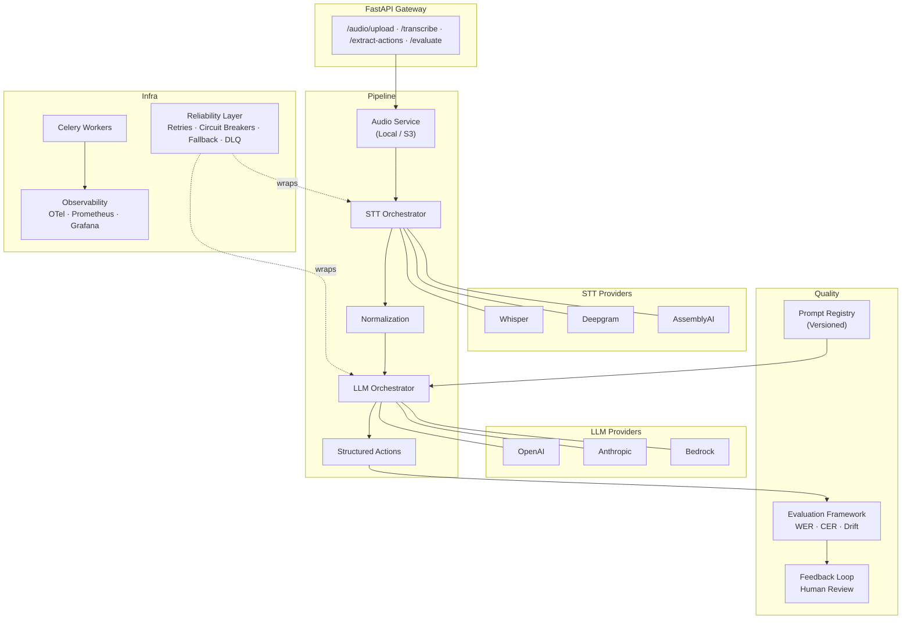
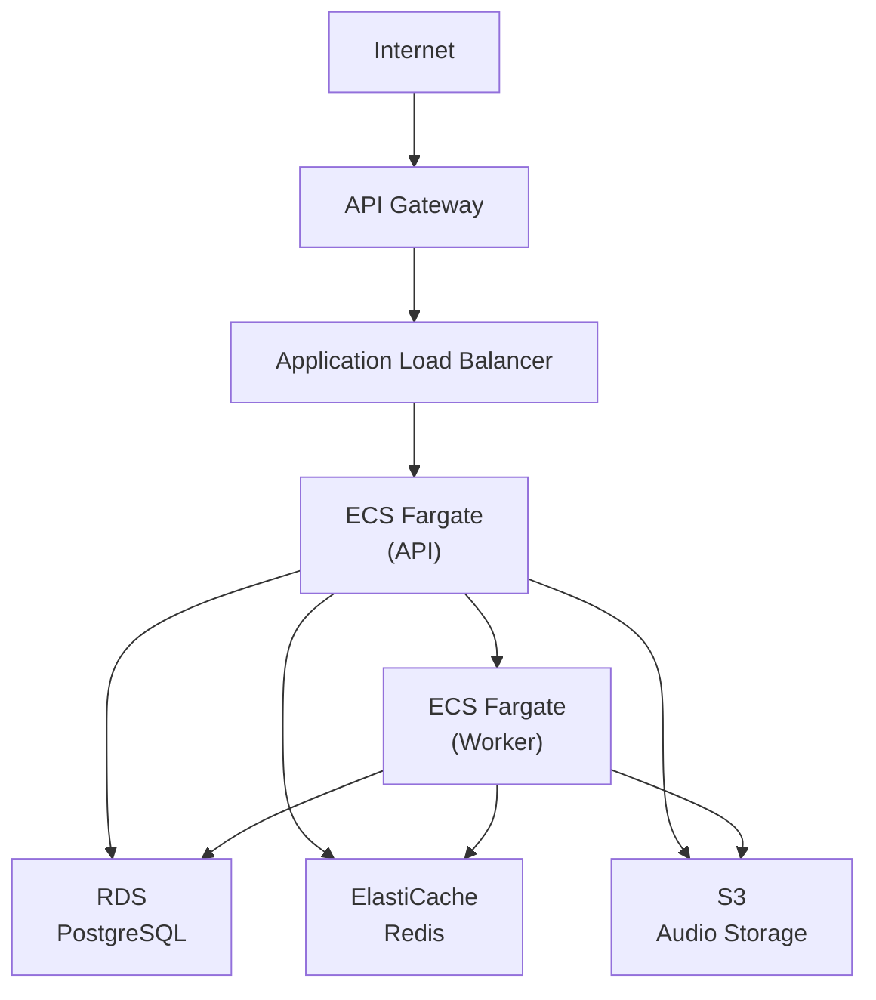

# Voice Orchestrator

**Production-grade Voice-to-Action AI Platform**

Turn spoken commands into structured, validated, measurable actions — with reliability, observability, and evaluation built in from day one.

---

## 1. Overview

Voice Orchestrator is a backend platform that accepts audio from mobile applications, converts speech to text, extracts structured actions using LLMs, and continuously measures the quality of every step.

This is not a demo. It is an operational system designed for teams that run non-deterministic AI pipelines in production and need to answer questions like:

- "Did last week's prompt change make extractions worse?"
- "Is Deepgram more accurate than Whisper for our users?"
- "What is our cost per successful action extraction?"
- "Are LLM outputs drifting from expected schemas?"


---

## 2. Why Voice Orchestrator Exists

Most AI demos stop at inference. Production AI systems fail at everything around inference:

| Problem | How Voice Orchestrator Solves It |
|---|---|
| Provider outages | Fallback chains with circuit breakers — Deepgram fails, Whisper takes over |
| Prompt regressions | Golden dataset regression suite compares old vs new prompts automatically |
| Cost surprises | Per-request cost tracking across every provider, surfaced in Grafana |
| Silent quality degradation | Drift detection catches when LLM outputs change distribution over time |
| "It works on my machine" | Evaluation framework with WER, CER, intent accuracy, entity F1 |
| No human oversight | Review queue where humans approve, reject, or correct AI output |

---

## 3. Architecture



### Clean Architecture

Every service follows domain-driven design:

```
domain/          # Models, interfaces (ports) — zero dependencies
  models/        # Pydantic domain models
  interfaces/    # ABC definitions for providers and repositories
services/        # Business logic — depends only on domain interfaces
infrastructure/  # Concrete implementations — DB repos, API adapters
evaluation/      # Metrics, drift detection, regression runner
reliability/     # Retry, circuit breaker, fallback, DLQ
observability/   # OpenTelemetry, Prometheus metrics
```

---

## 4. Features

### Multi-Provider STT
- **Whisper** (OpenAI) — high accuracy, higher latency
- **Deepgram** (Nova-2) — low latency, streaming-ready
- **AssemblyAI** — strong punctuation and formatting

Swap providers per-request or globally. Every call records latency, confidence, and cost.

### Multi-Provider LLM Extraction
- **OpenAI** (GPT-4o)
- **Anthropic** (Claude Sonnet)
- **AWS Bedrock** (Claude via Bedrock)

### Prompt Versioning
Every prompt is versioned with author, change reason, and activation history. Roll back a bad prompt in one API call.

### Reliability
- **Retry with exponential backoff** — configurable per-provider
- **Circuit breakers** — auto-open after N failures, auto-recover
- **Fallback chains** — Deepgram → Whisper, Claude → GPT
- **Dead letter queue** — failed requests preserved for investigation

### Evaluation Framework
- Word Error Rate (WER) and Character Error Rate (CER)
- Intent accuracy, entity precision/recall/F1
- Output drift and schema drift detection
- Golden dataset regression suite
- Human feedback loop with quality reports

### Observability
- OpenTelemetry distributed tracing across the full pipeline
- Prometheus metrics for latency, cost, errors, circuit breaker state
- Pre-built Grafana dashboard
- Structured JSON logging with correlation IDs

---

## 5. Usage Examples

### Mobile Productivity Assistant

Convert voice commands into calendar, email, and scheduling actions.

**Input**
```text
Schedule a meeting with Andrew next Tuesday at 2 PM
```

**Output**
```json
{
  "intent": "create_meeting",
  "person": "Andrew",
  "date": "2026-06-09",
  "time": "14:00"
}
```

---

### Field Service Automation

Transform technician voice notes into structured work orders and CRM updates.

**Input**
```text
Customer reported HVAC compressor failure. Replace unit and schedule follow-up Friday.
```

**Output**
```json
{
  "ticket_type": "repair",
  "equipment": "HVAC compressor",
  "followup_date": "Friday"
}
```

---

### Healthcare Documentation

Convert clinician dictation into structured medical records.

**Input**
```text
Patient reports mild chest discomfort for three days.
```

**Output**
```json
{
  "symptom": "chest discomfort",
  "duration": "3 days",
  "severity": "mild"
}
```

---

### Customer Support Automation

Automatically classify customer requests and trigger downstream workflows.

**Input**
```text
Customer wants to cancel premium subscription effective immediately.
```

**Output**
```json
{
  "intent": "cancel_subscription",
  "plan": "premium"
}
```

---

### Sales CRM Intelligence

Turn voice notes into CRM updates and follow-up actions.

**Input**
```text
Met with Acme. Budget approved. Send proposal this week.
```

**Output**
```json
{
  "company": "Acme",
  "budget_status": "approved",
  "next_action": "send proposal"
}
```

Integrations: Salesforce · HubSpot · Dynamics 365

---

### Warehouse Operations

Enable hands-free inventory management through voice commands.

**Input**
```text
Move pallet A17 to zone 4.
```

**Output**
```json
{
  "action": "move_inventory",
  "item": "A17",
  "destination": "zone_4"
}
```

---

### Call Center Analytics

Analyze conversations for sentiment, risk, compliance, and escalation.

**Output**
```json
{
  "sentiment": "negative",
  "risk": "high",
  "escalate": true
}
```

---

### AI Meeting Assistant

Extract decisions, owners, and action items from meetings.

**Input**
```text
Santhosh will own the AWS migration. Andrew will review security.
```

**Output**
```json
{
  "tasks": [
    {
      "owner": "Santhosh",
      "task": "AWS migration"
    },
    {
      "owner": "Andrew",
      "task": "security review"
    }
  ]
}
```

---

### Enterprise AI Agent

Connect voice workflows directly to enterprise systems.

**Input**
```text
Create a Jira ticket for the payment service latency issue.
```

**Output**
```json
{
  "action": "create_jira",
  "title": "Payment service latency issue"
}
```

---

## 6. API Workflows

### Upload and Process Audio

```bash
# Upload audio file (field technician recording)
curl -X POST http://localhost:8000/api/v1/audio/upload \
  -F "file=@incident_report.wav"

# Response:
# {
#   "audio_file_id": "a1b2c3d4-...",
#   "filename": "incident_report.wav",
#   "format": "wav",
#   "size_bytes": 96000
# }
```

### Transcribe Audio

```bash
curl -X POST http://localhost:8000/api/v1/transcribe \
  -H "Content-Type: application/json" \
  -d '{
    "audio_file_id": "a1b2c3d4-...",
    "provider": "deepgram",
    "language": "en"
  }'

# Response:
# {
#   "id": "t1e2s3t4-...",
#   "transcript": "Create a Jira ticket for the payment service latency issue",
#   "confidence": 0.96,
#   "provider": "deepgram",
#   "latency_ms": 342.5,
#   "cost_usd": 0.00012
# }
```

### Extract Actions

```bash
curl -X POST http://localhost:8000/api/v1/extract-actions \
  -H "Content-Type: application/json" \
  -d '{
    "text": "Create a Jira ticket for the payment service latency issue",
    "provider": "openai",
    "prompt_id": "default"
  }'

# Response:
# {
#   "id": "e1x2t3-...",
#   "actions": [
#     {
#       "action": "create_jira",
#       "title": "Payment service latency issue"
#     }
#   ],
#   "provider": "openai",
#   "model": "gpt-4o",
#   "latency_ms": 890.2,
#   "input_tokens": 245,
#   "output_tokens": 68,
#   "cost_usd": 0.00129
# }
```

### Evaluate an Extraction

```bash
curl -X POST http://localhost:8000/api/v1/evaluate \
  -H "Content-Type: application/json" \
  -d '{
    "extraction_id": "e1x2t3-...",
    "expected_actions": [
      {
        "action": "create_jira",
        "title": "Payment service latency issue"
      }
    ]
  }'

# Response:
# {
#   "intent_accuracy": 1.0,
#   "entity_precision": 1.0,
#   "entity_recall": 1.0,
#   "entity_f1": 1.0
# }
```

### Manage Prompts

```bash
# Create a new prompt version
curl -X POST http://localhost:8000/api/v1/prompts/ \
  -H "Content-Type: application/json" \
  -d '{
    "prompt_id": "action-extractor",
    "template": "You are an AI that extracts structured actions...",
    "author": "alice@company.com",
    "change_reason": "Improved date parsing instructions",
    "activate": true
  }'

# Activate a specific version
curl -X POST http://localhost:8000/api/v1/prompts/activate \
  -H "Content-Type: application/json" \
  -d '{"prompt_id": "action-extractor", "version": 2}'

# List all prompt versions
curl http://localhost:8000/api/v1/prompts/action-extractor/versions
```

### Submit Human Feedback

```bash
# Approve an extraction
curl -X POST http://localhost:8000/api/v1/feedback/ \
  -H "Content-Type: application/json" \
  -d '{
    "extraction_id": "e1x2t3-...",
    "status": "approved",
    "reviewer": "bob@company.com"
  }'

# Correct an extraction
curl -X POST http://localhost:8000/api/v1/feedback/ \
  -H "Content-Type: application/json" \
  -d '{
    "extraction_id": "e1x2t3-...",
    "status": "corrected",
    "corrected_actions": [
      {"intent": "create_meeting", "person": "Jonathan", "date": "2026-06-04", "time": "15:00"}
    ],
    "reviewer": "bob@company.com",
    "notes": "Name was Jonathan, not John"
  }'

# View review queue
curl http://localhost:8000/api/v1/feedback/queue
```

### Check Metrics

```bash
curl http://localhost:8000/api/v1/metrics

# Response:
# {
#   "total_requests": 1250,
#   "success_rate": 0.97,
#   "avg_latency_ms": 1430.5,
#   "avg_cost_usd": 0.0032,
#   "by_provider": {
#     "deepgram": {"requests": 800, "avg_latency_ms": 340},
#     "whisper": {"requests": 450, "avg_latency_ms": 1200}
#   }
# }
```

### Compare Providers

```bash
curl http://localhost:8000/api/v1/providers/compare

# Response:
# {
#   "results": [
#     {"provider": "deepgram", "avg_latency_ms": 340, "avg_cost": 0.001, "error_rate": 0.02},
#     {"provider": "whisper", "avg_latency_ms": 1200, "avg_cost": 0.003, "error_rate": 0.01}
#   ]
# }
```

---

## 7. Evaluation Framework

The evaluation framework is the core differentiator. It answers: "Is my AI pipeline getting better or worse?"

### Metrics Computed

| Metric | What It Measures | Target |
|---|---|---|
| WER (Word Error Rate) | Transcription accuracy vs reference | < 0.15 |
| CER (Character Error Rate) | Character-level transcription accuracy | < 0.10 |
| Intent Accuracy | % of correctly classified intents | > 0.95 |
| Entity F1 | Precision/recall balance on extracted entities | > 0.85 |
| Output Drift | Distribution shift in intent types over time | < 0.10 |
| Schema Drift | Novel field patterns appearing in outputs | < 0.05 |

### Golden Dataset Regression

Store known-good examples and run them against pipeline changes:

```python
from voice_orchestrator.evaluation.regression import RegressionRunner

runner = RegressionRunner(
    stt_provider=whisper,
    llm_provider=openai,
    system_prompt=prompt_v3,
    wer_threshold=0.2,
    intent_accuracy_threshold=0.9,
)

report = await runner.run(golden_samples)

print(f"Pass rate: {report.pass_rate:.0%}")
print(f"Avg WER: {report.avg_wer:.3f}")
print(f"Avg Intent Accuracy: {report.avg_intent_accuracy:.3f}")
```

### Comparing Configurations

Run the same golden dataset with different configurations to decide:

```
Prompt v2 + GPT-4o:     intent_accuracy=0.92, entity_f1=0.87, cost=$0.0034
Prompt v3 + GPT-4o:     intent_accuracy=0.96, entity_f1=0.91, cost=$0.0038
Prompt v3 + Claude:      intent_accuracy=0.94, entity_f1=0.89, cost=$0.0041
```

### Human Feedback Quality Reports

```python
from voice_orchestrator.services.feedback import FeedbackService

report = await feedback_service.compute_agreement_rate()
# {"agreement_rate": 0.87, "approved": 435, "rejected": 28, "corrected": 67}
```

---

## 8. Provider Benchmarking

### STT Provider Comparison

| Provider | Avg Latency | Cost/min | Best For |
|---|---|---|---|
| Whisper (OpenAI) | ~1200ms | $0.006 | Accuracy, multilingual |
| Deepgram (Nova-2) | ~340ms | $0.0043 | Speed, real-time |
| AssemblyAI | ~800ms | $0.015 | Formatting, punctuation |

### LLM Provider Comparison

| Provider | Avg Latency | Input $/M | Output $/M | Best For |
|---|---|---|---|---|
| GPT-4o | ~900ms | $2.50 | $10.00 | Structured output, JSON |
| Claude Sonnet | ~1100ms | $3.00 | $15.00 | Nuance, complex commands |
| Bedrock (Claude) | ~1300ms | $3.00 | $15.00 | AWS-native, VPC isolation |

Voice Orchestrator tracks these per-request so you always have real numbers, not benchmarks.

---

## 9. Running Locally

### Prerequisites

- Python 3.11+
- Docker and Docker Compose
- Make (optional)

### Quick Start

```bash
# Clone the repository
git clone https://github.com/yablokolabs/voice-orchestrator.git
cd voice-orchestrator

# Create virtual environment
python3 -m venv .venv
source .venv/bin/activate

# Install dependencies
pip install -e ".[dev]"

# Copy environment config
cp .env.example .env
# Edit .env with your API keys

# Start infrastructure (Postgres, Redis, Prometheus, Grafana)
docker compose up -d postgres redis prometheus grafana

# Run database migrations
alembic upgrade head

# Start the API server
uvicorn voice_orchestrator.api.app:create_app --factory --reload --port 8000

# In another terminal — start Celery worker
celery -A voice_orchestrator.tasks.celery_app worker --loglevel=info
```

### Full Stack with Docker Compose

```bash
# Start everything
docker compose up -d

# API:        http://localhost:8000
# Grafana:    http://localhost:3000  (admin/admin)
# Prometheus: http://localhost:9090
```

### Running Tests

```bash
# All tests
pytest

# Unit tests only
pytest tests/unit -v

# Integration tests
pytest tests/integration -v

# With coverage
pytest --cov=voice_orchestrator --cov-report=html

# Load tests (requires running server)
locust -f tests/load/locustfile.py --host http://localhost:8000
```

### Environment Variables

| Variable | Default | Description |
|---|---|---|
| `VO_DATABASE_URL` | `postgresql+asyncpg://...` | PostgreSQL connection |
| `VO_REDIS_URL` | `redis://localhost:6379/0` | Redis connection |
| `VO_DEFAULT_STT_PROVIDER` | `whisper` | Default STT provider |
| `VO_DEFAULT_LLM_PROVIDER` | `openai` | Default LLM provider |
| `VO_OPENAI_API_KEY` | — | OpenAI API key |
| `VO_ANTHROPIC_API_KEY` | — | Anthropic API key |
| `VO_DEEPGRAM_API_KEY` | — | Deepgram API key |
| `VO_ASSEMBLYAI_API_KEY` | — | AssemblyAI API key |
| `VO_MAX_RETRIES` | `3` | Max retry attempts |
| `VO_CIRCUIT_BREAKER_FAIL_MAX` | `5` | Circuit breaker threshold |
| `VO_REQUEST_TIMEOUT` | `30.0` | Request timeout in seconds |

See `.env.example` for the full list.

---

## 10. Deployment

### AWS Architecture



### Deploy with Terraform

```bash
cd terraform/environments/dev

# Initialize
terraform init

# Plan
terraform plan -out=plan.tfplan

# Apply
terraform apply plan.tfplan
```

### CI/CD

GitHub Actions runs on every push:

1. **Lint** — ruff + mypy
2. **Test** — pytest with PostgreSQL service container
3. **Build** — Docker image
4. **Deploy** (main branch only) — Push to ECR, update ECS service

---

## 11. Observability

### Grafana Dashboard

Access at `http://localhost:3000` (admin/admin) after `docker compose up`.

Pre-built panels:
- **Request Rate** — requests/sec by endpoint
- **Latency Distribution** — p50/p95/p99 across STT and LLM providers
- **Error Rate** — failures by provider and endpoint
- **Cost Tracking** — cumulative USD spent, broken down by provider
- **Circuit Breaker State** — open/closed/half-open per provider
- **Active Pipelines** — currently processing requests

### OpenTelemetry Tracing

Every request produces a distributed trace:

```mermaid
gantt
    title Pipeline Trace — single request
    dateFormat X
    axisFormat %L ms

    section STT
    stt.transcribe (deepgram)     :0, 340

    section Normalize
    normalize                      :340, 342

    section LLM
    llm.extract (openai, 297 tok) :342, 1232

    section DB
    db.store                       :1232, 1244
```



### Structured Logging

```json
{
  "event": "pipeline_complete",
  "pipeline_id": "p1a2b3c4",
  "audio_file_id": "a1b2c3d4",
  "total_latency_ms": 1244.3,
  "total_cost_usd": 0.0032,
  "num_actions": 1,
  "timestamp": "2026-06-03T18:30:00Z",
  "level": "info"
}
```

---

## 12. Roadmap

- [ ] **Streaming STT** — Real-time transcription via WebSocket with Deepgram streaming API
- [ ] **A/B testing framework** — Route traffic between prompt/model variants and track metrics
- [ ] **LangGraph agent** — Internal AI agent that evaluates prompts, compares providers, recommends upgrades
- [ ] **S3 audio storage** — Replace local filesystem with S3 backend for production
- [ ] **Multi-language support** — Extend STT and LLM prompts for non-English commands
- [ ] **Webhook notifications** — Push pipeline results and evaluation alerts to external systems
- [ ] **Rate limiting** — Per-user and per-API-key request throttling
- [ ] **AG-UI layer** — Operator dashboard for prompt management and evaluation review
- [ ] **LangSmith integration** — Ship LLM traces to LangSmith for deeper prompt debugging
- [ ] **Batch processing** — Upload CSV of audio files for bulk pipeline runs

---

## API Reference

| Method | Endpoint | Description |
|---|---|---|
| `GET` | `/health` | Health check |
| `POST` | `/api/v1/audio/upload` | Upload audio file |
| `POST` | `/api/v1/transcribe` | Transcribe audio to text |
| `POST` | `/api/v1/extract-actions` | Extract structured actions |
| `POST` | `/api/v1/evaluate` | Evaluate extraction accuracy |
| `GET` | `/api/v1/metrics` | Pipeline metrics |
| `GET` | `/api/v1/providers/compare` | Compare provider performance |
| `GET` | `/api/v1/prompts/` | List prompts |
| `POST` | `/api/v1/prompts/` | Create prompt version |
| `POST` | `/api/v1/prompts/activate` | Activate prompt version |
| `POST` | `/api/v1/feedback/` | Submit human feedback |
| `GET` | `/api/v1/feedback/queue` | View review queue |

---

## Enterprise Voice Intelligence Platform

Voice Orchestrator is more than a voice assistant. It is an infrastructure platform for building reliable AI decision pipelines.

### Core Capabilities

- Multi-provider STT orchestration
- LLM routing and fallback strategies
- Prompt evaluation and benchmarking
- Automated regression testing
- Golden dataset validation
- Human-in-the-loop review workflows
- End-to-end observability
- Cost analytics and optimization
- Quality monitoring and drift detection
- Structured action execution

---

## License

MIT